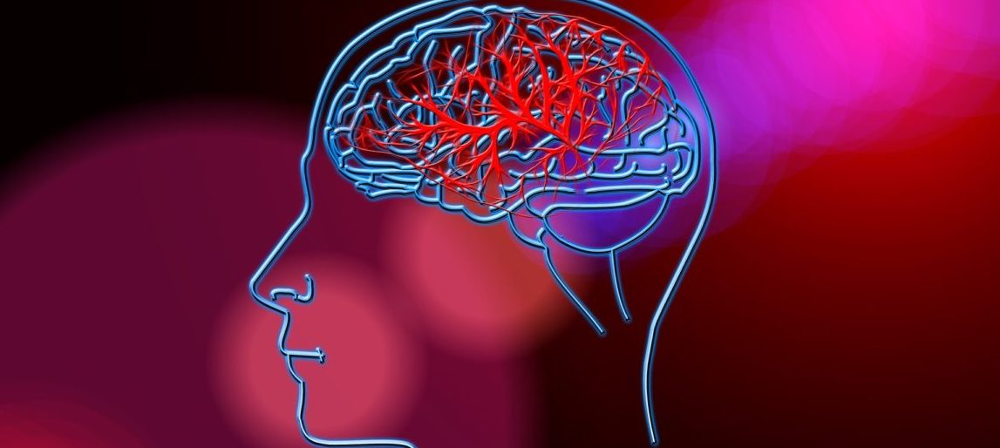
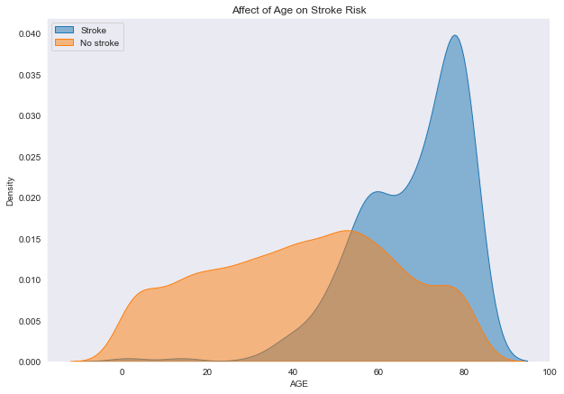
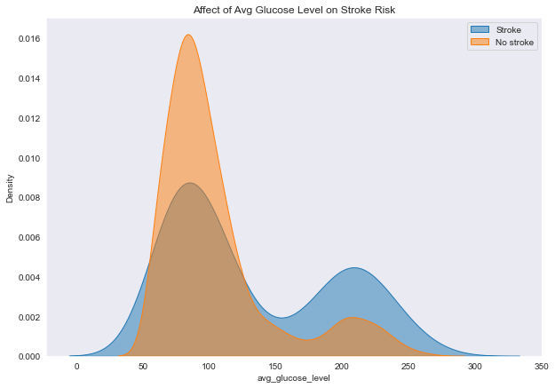
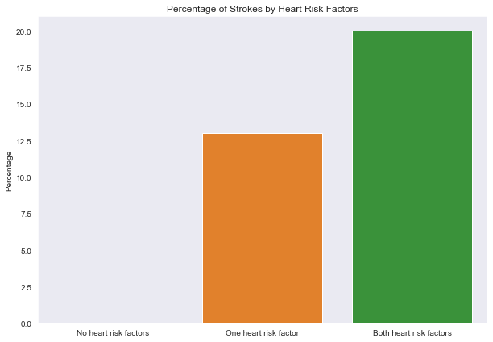
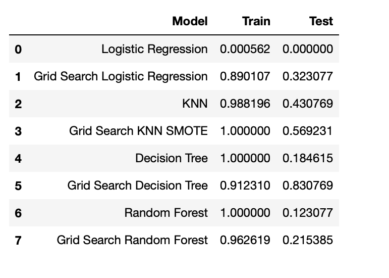
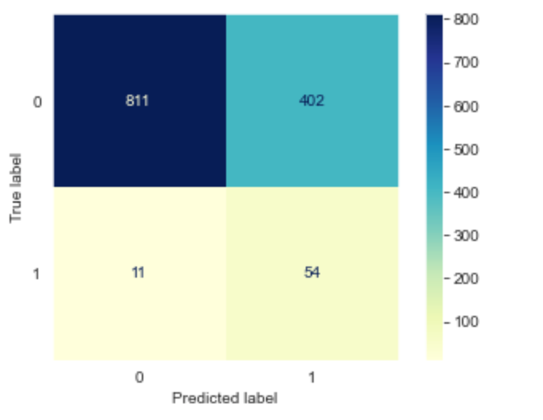

# Stroke_Predictions
**Authors: Jaclyn Dwyer** - Updated from original Phase3Proj project with Anisha Malhotra



## Overview
This project examines data regarding risk factors for strokes. According to the CDC, strokes are the fifth leading cause of death in the United States. The goal of this project is to create a model for preliminary screening that can predict if a person is going to have a stroke. This model would allow patients to take measures in order to prevent having a stroke. The models will be evaluated using recall scores in order to minimize false negatives.

## Methods
The methodology for this project includes data cleaning, exploratory data analysis, feature engineering, and running various models to determine the model with the highest recall score.

## Exploratory Data Analysis
Graphs are created to explore the relationships between stroke risk factors and strokes. The graphs included here look at age and average glucose levels.



This graph shows that the number of strokes increases as age increases.



At a normal glucose level (less than 140), no strokes are more prominent than strokes. On the other hand, at pre-diabetic (between 140 and 200) and diabetic levels (greater than 200), strokes are more prevalent than no strokes.

## Feature Engineering
Features are engineered including a "heart_rf" feature to take into account the cumulative heart risk factors. The percentage of people who had a stroke for each category was calculated as follows: no heart risk factors- 0.03%, one heart risk factor- 13%, both heart risk factors- 20%.



The graph shows that those with both heart risk factors (hypertension and heart disease) have a much higher incidence of strokes than those with no heart risk factors.

## Model
The models will be evaluated based on recall score, since recall minimizes false negatives. False negatives could be dangerous to patients as they would tell patients they are not at risk for a stroke when they really are. There is a significant class imbalance in the dataset between people who have not had a stroke and those who have. Tomek Links and SMOTE will be used in order to fix the class imbalance issue.

## Model Evaluation
The model that performed the best is the Grid Search Decision Tree model based off the higher recall score on the test data. While some models have higher recall scores for the train data, their recall score is much lower indicating more overfitting.



To further evaluate the model a confusion matrices is plotted.



For the test data, this model is able to catch about 83% of strokes. While there is a false positive rate of about 33%, further screenings would prove the patient to be healthy.

## Final Model
The goal for this model is to catch as many people as possible who will have a stroke. By doing this, interventions can be put in place allowing patients to take measures in order to prevent having a stroke. Grid Search Decision Tree model is determined to be the best model when analyzing recall scores.

## Next Steps
Further analysis could benefit from the following:
  - Run more GridSearches on models to determine if a model with an even higher recall score exists
  - Feature engineer from outside sources to implement risk factors
  - Run model on more unseen data

## Repository Structure
```
├── data
├── images
├── Final_Notebook.ipynb
└──  README.md
```
